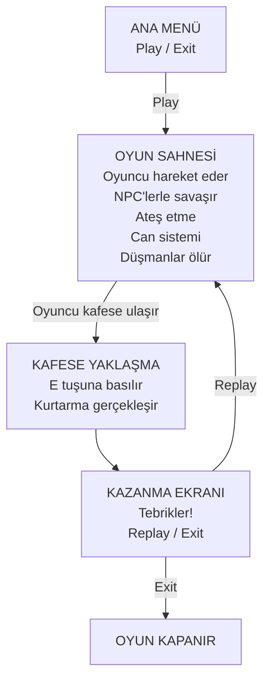

# ThirdPersonShooterGame
<div align="center">


</div>

---
##  Proje Hakkında

Bu proje, **Yazılım Geliştirme Laboratuvarı** dersi kapsamında geliştirilmiş bir **Third Person Shooter (TPS)** oyunudur.

Projenin amacı, üçüncü şahıs bakış açısına sahip oyunların temel mekaniklerini öğrenmek ve uygulamaktır. Oyunda karakter kontrolü, ateş etme sistemi, düşman yapay zekası ve görev tabanlı ilerleme bulunmaktadır.

---
##  Oyun Senaryosu

Oyuncu, düşmanlarla dolu bir bölgede bulunan bir askeri kontrol eder.

Amaç:
- Düşmanları etkisiz hale getirmek
- Haritada ilerlemek
- Rehineyi kurtarmak

Bu proje tek sahneden oluşan oynanabilir bir oyun prototipidir.

---
##  Oyun Akışı

```text
ANA MENÜ
   |
   | Oyuna Başla
   v
OYUN SAHNESİ
   |
   | Oyuncu düşmanlarla savaşır ve rehineye ulaşır
   v
REHİNE KURTARMA
   |
   | E tuşuna basılır
   v
KAZANMA EKRANI
   |
   | Tekrar oyna / çık
````
---
## Oyun Mantığı

- Oyuncu oyuna ana menüden başlar.
- "Oyuna Başla" butonuna basıldığında oyun sahnesi yüklenir.
- Oyuncu WASD tuşları ile hareket eder ve mouse ile kamerayı kontrol eder.
- Sol tık ile düşmanlara ateş edilir.
- Düşman NPC'ler oyuncuya saldırır.
- Oyuncunun canı azalır ve sıfıra düşerse oyun başarısız olur.
- Oyuncu haritada ilerleyerek rehineye ulaşır.
- Rehineye yaklaşıldığında ekranda etkileşim mesajı çıkar.
- "E" tuşuna basıldığında rehine kurtarılır.
- Rehine kurtarıldıktan sonra oyun kazanma ekranına geçer.
---
## Mekaniklerin Blok Diyagramı

---
## OYUN MEKANİKLERİ
  1. NPC HAREKETLERİ
      - Idle, Patrol, Chase, Attack mekaniklerine sahiptir.
      - NavMeshAgent kullanarak belirlenen waypointler arasında devriye gezmektedirler.
      - Player' ı görünce Chase State' e geçip en kısa yoldan kovalamaya başlarlar.
  2. OYUNCU HAREKETLERİ
      - Movement State script' i ile karakterimiz hareket etmektedir.
      - Karakterimiz yürüyebilir, nişan alabilir, ateş edebilir, eğilebilir, cover alabilir.
  3. TRIGGER ALANLARI
      - NPC görüşüne girdiğimizde Chase State triggerlanır.
      - Tutsakın yanına gittiğimizde kurtarma scripti triggerlanır ve oyun sonu ekranı gelir.
  ---
  ## ASARLANAN SAHNELER
  1. ANA MENÜ SAHNESİ
      - Oyunu başlatma ve çıkış tuşları bulunmakta
  2. OYUN SAHNESİ
      - Oyunu oynadığımız sahnedir.
      - Bir bilim kurgu deposunda geçmektedir.
      - İçerisinde NPC ler bulunmakta.
  3. KAZANMA SAHNESİ
      - Tebrik mesajı içerir.
      - Tekrar oyna ve çıkış butonları bulunur.

## LİTERATÜR TARAMASI VE ÖRNEK ÇALIŞMALAR
  - Oyunu tasarlarken youtube üzerinden birçok TPS oyun tutorialları taranmıştır.
  - Mekaniklerin kodlanmasında bu kaynaklardan yardım alınmış fakat birebir kodlar kullanılmamıştır.

## KULLANILAN YAZILIM MİMARİLERİ
- Proje Unity, Visual Studio, Visual Studio Code kullanılarak yapılmıştır.
- C# dili ve Unity kütüphaneleri proje genelinde kullanılmıştır.

## KARŞILAŞILAN ZORLUKLAR
- NPC' ler önce kapsül olarak tasarlanmış ve kodlanmış daha sonra karakterler eklenmiştir. Bu sebeple karakter ve animasyon eklemede zorlanılmıştır.
- Nişan alma ve ateş etme mekaniklerinde zorlanılmıştır.
- Youtube, Reddit gibi sitelerde araştırmalar yapılarak çözüm yolları bulunmuştur.

## PROJEDEN KAZANIMLAR
- Unity arayüzü ve kütüphaneleri öğrenilmiş, unity deneyimi kazanılmıştır.
- NPC mekanikleri State Machine nasıl çalışır genel yapısı nedir öğrenilmiştir.
- Animator kullanımı öğrenilmiştir.
- Git ve GitHub kullanmada deneyim kazanılmıştır.
